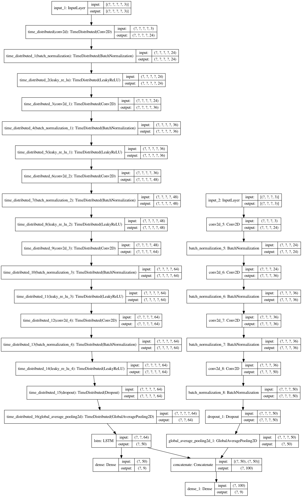

# SelfDrivingAmericanTruck
An end to end self driving system with navigation fusion.

Example video:

1. youtube: 

2. iqiyi(for China): 

# Start self driving

## step -1 first launch game

1. Make your `American Truck Simulator` in small window mode. Maybe like this

2. You may not modify any arguments if you are running on a `mac book pro(2019)`, otherwise, modify some arguments in `utils.py` to adapt the screen recorder.

## step 0 adjust sight line

1. Select a task using `Peterbilt` truck like this

2. Press key `1` to change drive mode.

3. Set your sight line like this(pay attention to the red rect)

## step 1 drive the truck to road

1. Please drive your truck to the road from your storehouse.

2. Keep running slowly.

## step 2 self driving

Run `control.py`, the application will turn to auto driving mode when the number increase to 9

# Train your own model

1. You may collect your own data by running `record_data.py`.
2. Run `train.py` to train your own model.

# Model architecture

